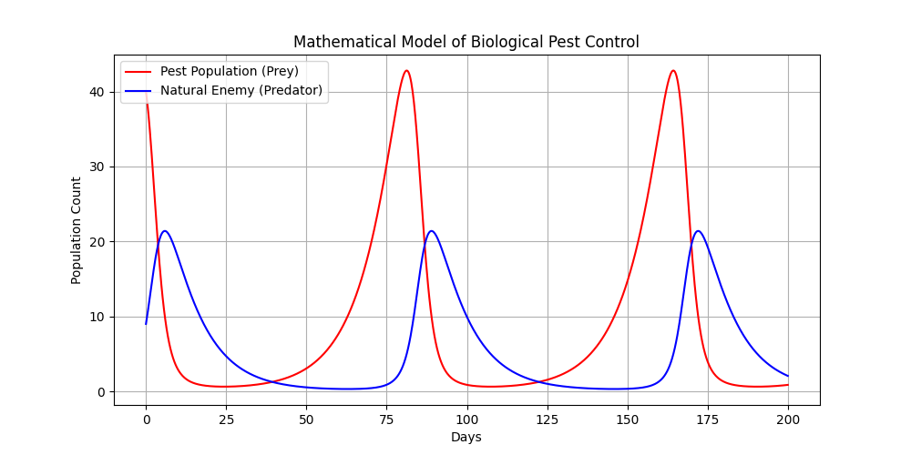

# Mathematical Modeling: Biological Pest Control Simulation

## Project Description
This project demonstrates the application of **Numerical Analysis** and **Differential Equations** to solve a real-world biological problem: controlling a pest population through the introduction of a natural predator. 

Using the **Lotka-Volterra Model**, I simulated the non-linear relationship between two interacting species. This type of modeling is essential in agricultural science for determining optimal predator release rates to ensure crop stability without chemical intervention.

## Mathematical Framework
The system is defined by two first-order non-linear ordinary differential equations (ODEs):

1. **Pest Population Growth:**  
   $$\frac{dx}{dt} = \alpha x - \beta xy$$
   *(Where $\alpha$ is the growth rate and $\beta$ is the predation rate)*

2. **Predator Population Growth:**  
   $$\frac{dy}{dt} = \delta xy - \gamma y$$
   *(Where $\delta$ is the reproduction efficiency and $\gamma$ is the natural death rate)*

## Technical Skills Demonstrated
*   **Scientific Computing:** Solving ODEs using `scipy.integrate.odeint`.
*   **Numerical Analysis:** Applying the Runge-Kutta method for time-series simulation.
*   **Data Visualization:** Using `matplotlib` to graph population oscillations and stability points.
*   **Parameter Tuning:** Adjusting biological rates to observe different ecological outcomes (stability vs. extinction).

## How to Run
1. Ensure Python 3.x is installed.
2. Install dependencies: `pip install numpy scipy matplotlib`.
3. Execute `pest_control_model.py` to generate the interactive plot.

